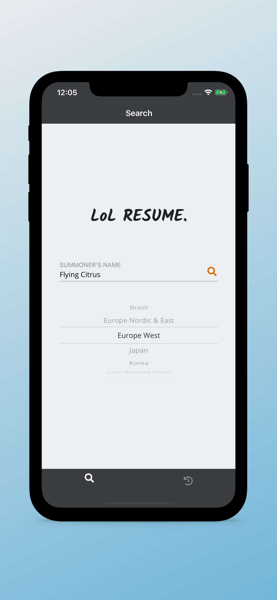
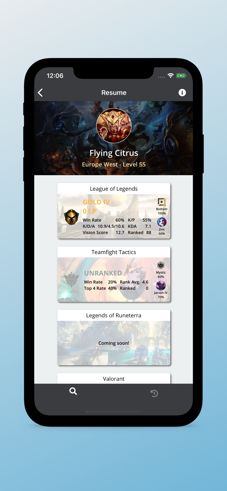
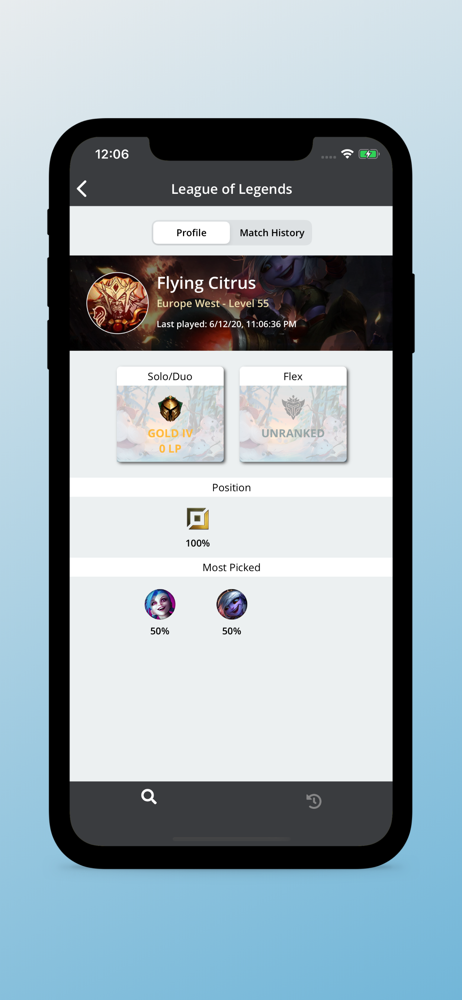
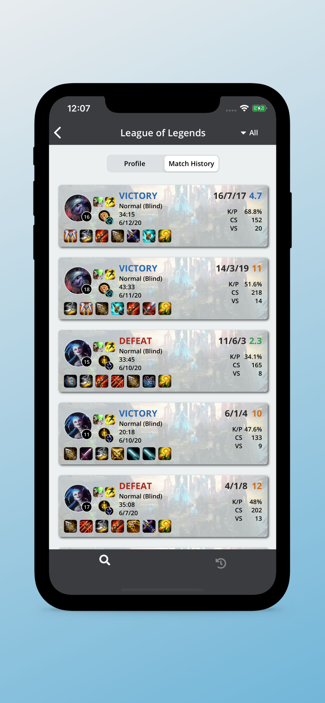
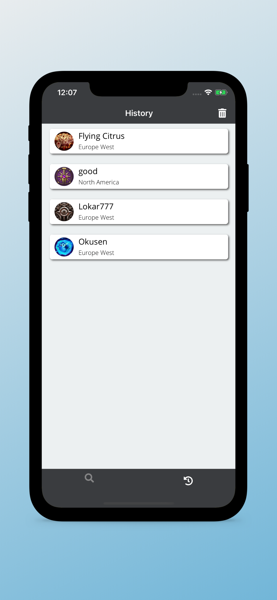

# LoL RESUME.

LoL RESUME. is an iOS app that displays statistics about all Riot Games using the resume concept in real life when we have to make one in order to get a job.

## Screenshots

    
    
    
    
    

## License

The content of this repository is licensed under a [MIT License](LICENSE).
