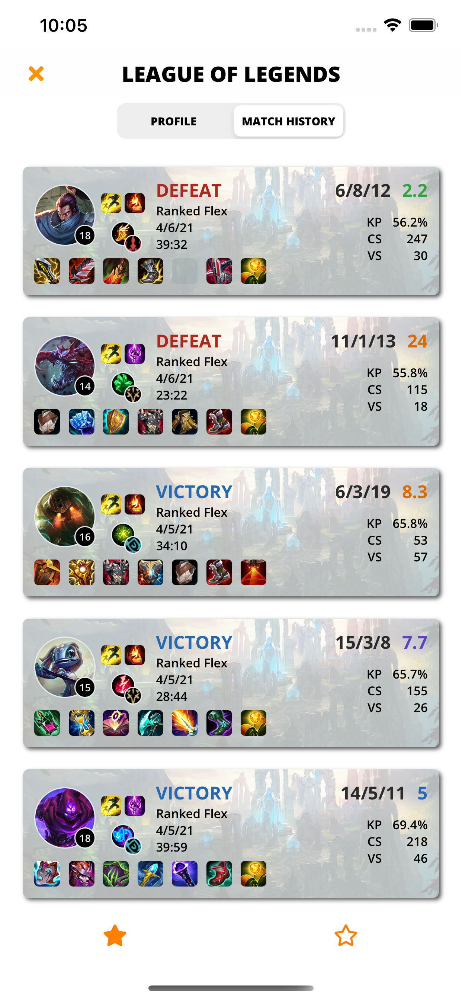

# LoL RESUME.

LoL RESUME. is an iOS app that displays statistics for a given player about League of Legends and TeamFight Tactics.

## Screenshots

    
    
    
    
    

## License

The content of this repository is licensed under a [MIT License](LICENSE).
